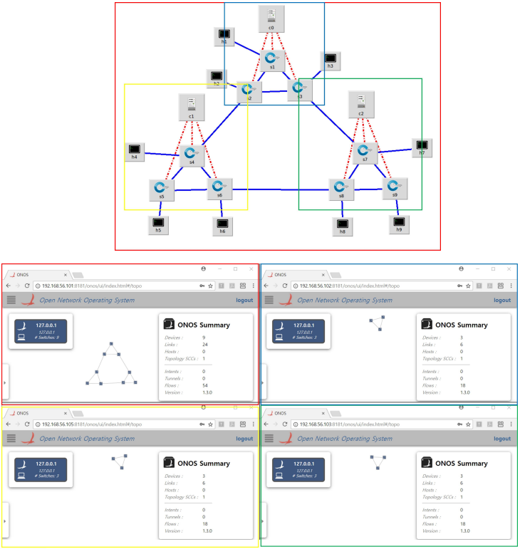

# SDN-Orchestration
## 1. SDN (Software-Defined Network)
소프트웨어 정의 네트워크. 개방형 API(오픈플로우)를 통해 네트워크의 트래픽 전달 동작을 소프트웨어 기반 컨트롤러에서 제어/관리하는 접근방식
## 2. ONOS (Open Network Operating System)
SDN Controller 중 하나로 Linux Foundation가 host 중인 오픈 소스 프로젝트
## 3. 프로젝트 목적
여러 ONOS들을 관리하기 위한 상위 계층의 ONOS 모듈 개발

하위 계층에 위치하는 ONOS들은 자신이 관리하는 네트워크 정보를 상위 계층의 ONOS로 mapping하여 전달
## 4. 실행 예시
독립적으로 존재하는 3개의 ONOS(c0, c1, c2)를 하나의 ONOS(IP : 192.168.56.101)에서 관리하고 있다

